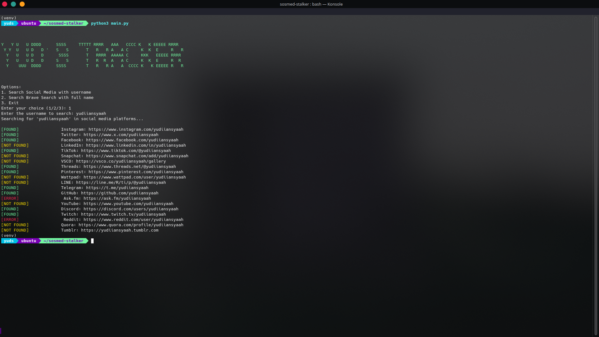
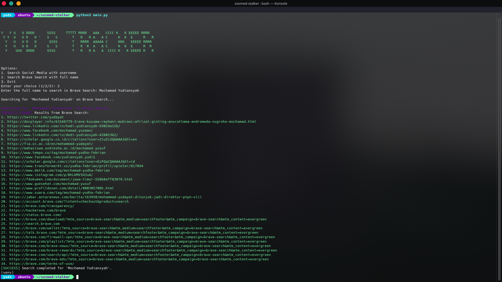

# SOSMED TRACKER
Hai bro dan sist! Gimana kalau sesekali kita pakai bahasa lokal, biar lebih dekat ya… 😄  
Tools `sosmed-tracker` ini saya buat sebagai proyek open-source dan free, jadi kalian bisa bebas pakai, modifikasi, atau bahkan kembangkan lebih lanjut sesuai kebutuhan. Tools ini cocok banget buat kalian yang hobi cari info spesifik tentang seseorang, atau mungkin para "STALKER" yang sedang mencari-cari informasi secara lebih detail. Eh, tapi jangan khawatir, ini semua cuma untuk tujuan yang baik kok! 😎

### Apakah ini Legal? ⚖️  
Tentu saja! Tools ini bekerja mirip dengan OSINT (Open Source Intelligence), yang mana sumber data yang digunakan terbuka dan diambil langsung dari Internet. Jadi, selama kalian pakai dengan bijak dan sesuai aturan yang ada, nggak ada masalah! Yang penting, jangan sampai salah gunakan untuk hal-hal yang nggak etis, ya! 🚫

### Apa Saja yang Bisa Dilacak? 🔍  
Dengan `sosmed-tracker`, kalian bisa melacak berbagai informasi yang tersedia di media sosial dan sumber-sumber terbuka lainnya, mulai dari akun media sosial, postingan, hingga berbagai jejak digital lainnya. Ingat, data yang diambil hanya yang memang sudah ada di internet dan bersifat terbuka untuk umum. Jadi, nggak ada yang sembunyi-sembunyi di sini! 🔓

### Punya Pertanyaan? 💬  
Jangan ragu untuk tanya! Tools ini dibuat untuk membantu kalian yang ingin menggali lebih dalam informasi yang ada di dunia maya. Kalau ada ide atau saran buat pengembangan, yuk saling diskusi dan berbagi! 💡

### DM untuk pertanyaan! 📩
- [Instagram](https://www.instagram.com/yudiiansyaah)
- [X/Twitter](https://www.x.com/yudiiansyaah)

---

## Tracker Sosmed  


## Tracker Search Engine  


---

## Cara Instalasi 🛠️

Pastikan kalian telah mempunyai GIT pada device kalian, jika belum terinstall, ikuti langkah di bawah ini:

- Linux
  
  ``` Debian/Ubuntu
  sudo apt install git # Debian/Ubuntu
  ```

  ``` Fedora
  sudo dnf install git # Fedora
  ```

  ``` Arch Linux
  sudo pacman -S git # Arch-linux
  ```

  ``` openSUSE
  sudo zypper in git # openSUSE
  ```

- macOS

  ``` bash
  brew install git
  ```

- Windows
  
  Kalian bisa langusng ke Website nya [Git's official website](https://git-scm.com/)

## Clone Repository saya dibawah ini:

  ``` bash/terminal
    git clone https://github.com/yudiiansyaah/sosmed-tracker.git
    cd sosmed-tracker
  ```

## Install VENV

- Linux/macOS
  ``` Linux/macOS
  python3 -m venv venv
  ```

- Windows
  ``` Windows
  python -m venv venv
  ```

## Aktifkan venv

- Linux/macOS
  ``` Linux/macOS
  source venv/bin/activate 
  ```

- Windows
  ```Windows
  venv\Scripts\activate
  ```

## Install file requirements.txt

- Linux/macOS/Windows
  ```Liunux/macOS/Windows
  pip install -r requirements.txt
  ```

## Jalankan ``sosmed-tracker``

- Linux/macOS
  ``` Linux/macOS
  python3 main.py
  ```

- Windows
  ```Windows
  python main.py
  ```

## Jika Tools Error

- `Note: Selalu ikuti langkah-langkah petunjuk diatas, jangan sampai ada yang terlewatkan`

# Note:
1. Pastikan Python telah terpasang pada device kalian, sesuai OS yang kalian gunakan.
2. Pastikan ``git`` telah terpasang juga pada sistem kalian.
3. Pastikan ``venv`` juga telah kalian install.
4. Setelah ``venv`` telah di install, jangan lupa untuk menjalankan venv dengan cara:
- Masuk ke folder ``sosmed-tracker`` pastikan ada foder ``venv`` didalamnya.
- Aktifkan ``venv`` seperti dibawah ini:
   ```bash
   source venv/bin/activate    # Linux/macOS
   venv\Scripts\activate       # Windows
   ```
5. Pastikan file ``requirements.txt`` telah di install, jika belum ikuti langkah dibawah ini:
   ```bash/terminal
   pip3 install -r requirements  # linux/macOS
   pip install -r requirements   # Windows
6. Jalankan tools ``sosmed-tracker`` dengan menggunakan:
   ```bash/terminal
   python3 main.py  # Linux/macOS
   python main.py   # Windows
   ```
## License
Projek ini dibawah licensed the  [MIT License](LICENSE).
   
